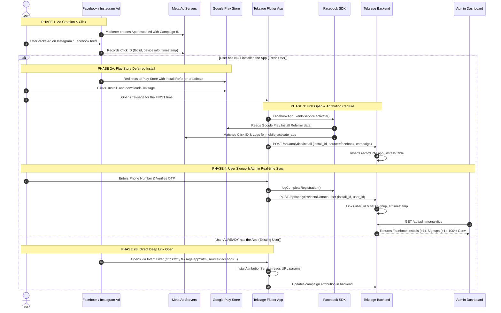

# Facebook Ads & Deep Link Attribution: Architecture, Flow & User Stories

This document provides a comprehensive technical and functional explanation of how **Facebook Ads**, **Deferred Deep Linking**, **Google Play Store attribution**, the **Flutter Mobile App**, and the **Teksage Admin Dashboard** work together from end to end.

---

## 1. Executive Summary & The Core Challenge

When running mobile user acquisition campaigns on Meta (Facebook & Instagram), there are two distinct user flows:

1. **Existing Users (App Already Installed):**  
   Click Ad $\rightarrow$ Direct OS Deep Link opens app $\rightarrow$ Query params (`utm_source`, `utm_campaign`, `fbclid`) are read directly by the app.
2. **Fresh Users (App NOT Installed):**  
   Click Ad $\rightarrow$ Redirects to **Google Play Store / Apple App Store** $\rightarrow$ User downloads and installs $\rightarrow$ User opens app for the first time.  

### The "Play Store Gap" Question:
> *"When a fresh user installs the app from the Play Store, the direct deep-link intent is not directly passed to the newly installed app binary on first open. How does Teksage capture the Facebook campaign and attribute the install?"*

---

## 2. The Solution: Dual-Layer Attribution Architecture

To ensure zero attribution loss, Teksage uses two coordinated tracking layers:

```
┌─────────────────────────────────────────────────────────────────────────────┐
│ 1. Meta SDK Layer (Native Meta Deferred Deep Linking)                       │
│    Meta Ads Manager ──▶ Google Play Install Referrer / Meta Graph API       │
│    Logs: Installs, Purchases, Signups directly inside Meta Ads Manager      │
├─────────────────────────────────────────────────────────────────────────────┤
│ 2. Teksage Attribution Layer (Admin Panel Analytics)                         │
│    First Open UUID ──▶ Backend /api/analytics/install ──▶ Attach User on OTP│
│    Displays: Installs, Signups, Conversion % in Teksage Admin Panel          │
└─────────────────────────────────────────────────────────────────────────────┘
```

### Layer 1: Meta SDK & Google Play Install Referrer
- **Android:** When a user clicks a Facebook/Instagram ad, Meta passes campaign parameters to the Google Play Store via Google's `INSTALL_REFERRER` broadcast. When the app is launched for the first time, the Facebook SDK queries the Google Play Install Referrer API locally on the device to retrieve the click token.
- **iOS & Android Cloud Matching:** When an ad is clicked, Meta registers a click event with device signals (IP, device model, timestamp). When `FacebookAppEventsService.activate()` runs on first open, Meta matches the device fingerprint and attributes the install to the exact campaign.

### Layer 2: Teksage App Attribution Engine
- Generates a persistent device install UUID (`teksage_app_install_id`) stored in secure local storage.
- Listens to native Android/iOS launch intents via method channels (`com.venzo.astroPrompt/deeplink`).
- Reports first-open attribution to `POST /api/analytics/install`.
- Upon successful phone OTP login, reports `POST /api/analytics/install/attach-user`, turning anonymous app installs into verified user registrations on the Admin Acquisition Dashboard.

---

## 3. End-to-End Sequence Diagram



---

## 4. User Stories

### User Story 1: The Fresh User (New Install & Signup)
- **Actor:** Priya (New user on Instagram, has never installed Teksage).
- **Trigger:** Priya sees an Instagram Ad: *"Check your Diwali planetary alignments with Teksage"*.
- **Journey:**
  1. **Ad Click:** Priya taps **"Install Now"**. Meta logs click parameters (`utm_source=facebook`, `utm_campaign=diwali_ad_2026`, `fbclid=test_fb_click_999`).
  2. **Play Store Redirect:** Because the app is not on her phone, Instagram redirects her to the Google Play Store page.
  3. **Download & First Launch:** Priya installs and opens the app.
  4. **Attribution Reporting:**
     - The Facebook SDK initializes and logs `fb_mobile_activate_app`.
     - `InstallAttributionService` registers a new install UUID and posts to `POST /api/analytics/install` with `source: "facebook"`, `campaign: "diwali_ad_2026"`.
     - Backend saves an `app_installs` record with `user_id = null`.
  5. **Signup / OTP Login:**
     - Priya enters her mobile number and verifies OTP.
     - The app calls `POST /api/analytics/install/attach-user`, linking Priya's `user_id` to the install row and stamping `signup_at = NOW()`.
     - The Facebook SDK logs `fb_mobile_complete_registration`.
  6. **Admin Dashboard Outcome:**
     - **Facebook Installs** counter increments by **+1**.
     - **Facebook Signups** increments by **+1**.
     - **Campaign Table** shows `diwali_ad_2026` with **100% conversion rate**.
     - **Activity Log** displays `Priya | 🤖 Android | Facebook | diwali_ad_2026 | ✓ Linked User`.

---

### User Story 2: The Re-engagement User (App Already Installed)
- **Actor:** Rahul (Existing user who already has Teksage installed).
- **Trigger:** Rahul sees a Facebook Ad: *"Book a Live Consultation with Astro Panditji"*.
- **Journey:**
  1. **Ad Click:** Rahul taps the ad URL:
     ```text
     https://my.teksage.app/?utm_source=facebook&utm_campaign=panditji_promo_2026&fbclid=IwAR999
     ```
  2. **Direct Intent Handling:** Android detects the intent filter in `AndroidManifest.xml` and launches Teksage directly.
  3. **In-App Processing:** `MainActivity.kt` sends the URL to Flutter via `com.venzo.astroPrompt/deeplink`.
  4. **Campaign Tagging:** The attribution service records `campaign: "panditji_promo_2026"`.
  5. **Conversion:** Rahul initiates checkout and completes payment $\rightarrow$ Facebook SDK logs `fb_mobile_initiated_checkout` and `fb_mobile_purchase`.
  6. **Meta Ads Manager Outcome:** Meta's algorithm optimizes delivery to find more paying customers with similar profiles.

---

## 5. End-to-End Data Flow Matrix

| Stage | Triggering Component | Target Destination | Data Transferred |
| :--- | :--- | :--- | :--- |
| **1. Ad Click** | Meta Ad Placement | Meta Graph Servers & Play Store | `utm_source=facebook`, `utm_campaign=diwali_ad_2026`, `fbclid` |
| **2. App First Open** | Flutter `main.dart` | Meta Graph API & Teksage Backend | `install_id: UUID`, `platform: android/ios`, `source: facebook`, `campaign: name` |
| **3. OTP Signup** | Mobile Auth Page | Meta Graph API & Teksage Backend | `user_id: 1052`, `registration_method: mobile_otp`, `signup_at: ISO timestamp` |
| **4. Payment** | Payment Flow | Meta Graph API | `fb_mobile_purchase`, `valueToSum: 499`, `currency: INR` |
| **5. Admin Analytics** | Admin Panel View | Admin UI | Total Installs, Signups, Conversion %, Platform breakdown, Real-time Activity Log |

---

## 6. How Marketing Should Format Ad URLs

When creating campaigns in **Meta Ads Manager**, always configure the destination URL using this standard pattern:

```text
https://my.teksage.app/?utm_source=facebook&utm_campaign=<CAMPAIGN_NAME>&utm_medium=paid
```

### Examples:
- **Diwali Campaign:** `https://my.teksage.app/?utm_source=facebook&utm_campaign=diwali_promo_2026&utm_medium=paid`
- **Astrologer Consultation:** `https://my.teksage.app/?utm_source=facebook&utm_campaign=astrologer_launch&utm_medium=paid`
- **Horoscope App Install:** `https://my.teksage.app/?utm_source=facebook&utm_campaign=daily_horoscope_ad&utm_medium=paid`

---

## 7. Verification & Testing Reference

To test attribution locally before running paid ad spend:

```powershell
# Android ADB Deep Link Simulation Command:
& "$env:LOCALAPPDATA\Android\Sdk\platform-tools\adb.exe" shell am start -a android.intent.action.VIEW -d "https://my.teksage.app/?utm_source=facebook&utm_campaign=qa_test_ad_2026&fbclid=test_fb_click_999" -n com.venzo.astroPrompt/.MainActivity
```
